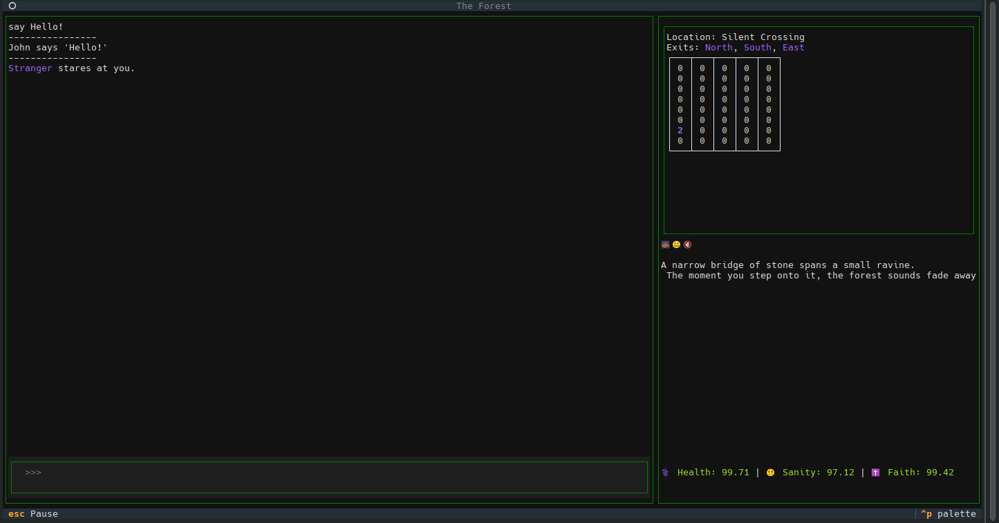

The Forest - console-based adventure game



# Install

```
poetry install 
```

# Running the game

```
poetry run python main.py
```


## The `move` command

```
move [north|south|east|west]
```

Alternatively, you can focus on the minimap and use the arrow keys to move your player (the blue 1 on the minimap)
